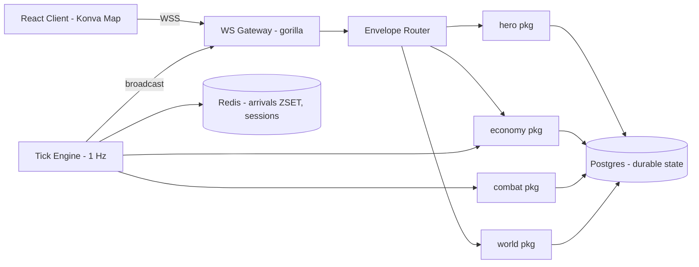
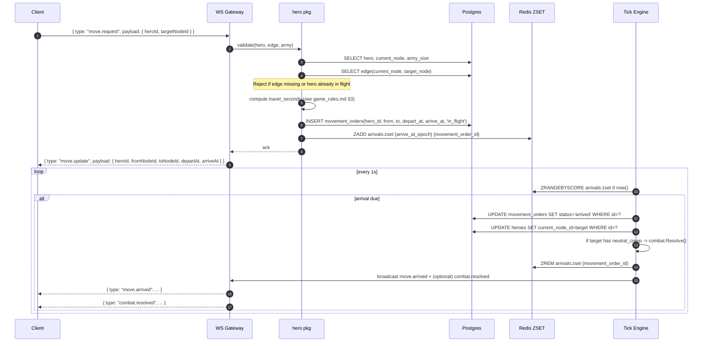

# Architecture

> **Status:** PoC v0.1 — Foundation document. Locked by Project Lead Agent.
> **Last updated:** 2026-05-20
> **Audience:** All future agents (Project Lead + Executors Alpha/Beta/Gamma). Read this before touching code or other docs.

This document is the single source of truth for the system design of the HOMM × OGame hybrid browser game. Every change to the stack, schema, or contract MUST be reflected here in the same PR.

---

## 1. PoC Scope Statement

The PoC validates the **core real-time loop**: server-authoritative movement timers across a node-graph map, a minimal economy, and a single auto-resolved combat encounter against a neutral creep. Everything else is deferred.

### 1.1 In Scope (PoC v0.1)

- **Module A — World & Movement**
  - Static, hardcoded 6-node graph with weighted edges (see §9.2).
  - Server-authoritative travel timers based on `distance_units / hero_speed`.
  - One `move(hero_id, target_node_id)` command, validated server-side.
- **Module B — Hero & Economy**
  - One starting castle per player, generating gold at a fixed rate (see [game_rules.md](./game_rules.md)).
  - One purchasable unit type (Pikeman).
  - One hero per player, with attributes `speed`, `attack`, `defense`, and an army stack.
- **Module C — Interactions & Anti-Snowballing**
  - One stationary neutral creep ("Bandit Camp") on a node.
  - Server-side deterministic auto-resolved combat on arrival at the creep's node.
  - **Upkeep system:** larger armies slow the hero down AND cost more gold/hour.

### 1.2 Explicitly Out of Scope (PoC v0.1)

The following are deliberately deferred. Executor agents MUST NOT bake assumptions about them into PoC code. They appear in §11 (Future Expansion Hooks) only as forward-compatibility notes.

- Multiple players colliding on the map (the world is single-player-instanced for PoC, but the server is multi-tenant).
- Hero-vs-hero combat, PvP, capture, ransom.
- Skill trees, XP, levels, gear, inventory beyond the army stack.
- Multiple unit types, unit tiers, unit production queues longer than one slot.
- Multiple castles per player, castle upgrades, buildings.
- Dynamic map (procgen, fog of war, vision range).
- Persistent chat, alliances, trade, market.
- Authentication. PoC hardcodes `player_id = 1` and `player_id = 2`. A real auth layer slots into the `players` table later.
- Pixel art. Map renders as colored circles + lines on a Konva canvas.
- Mobile/touch UX. Desktop browser only.
- Anti-cheat beyond server-authoritative validation of move legality.

---

## 2. Tech Stack & Rationale

| Layer | Choice | Why |
|---|---|---|
| Backend language | **Go 1.22+** | Goroutines + channels make the 1 Hz tick loop and per-connection WS goroutines trivial; static binary deploy; stdlib HTTP/WS are production-grade. |
| HTTP router | **`go-chi/chi` v5** | Stdlib-style, no magic, middleware-friendly. |
| WebSockets | **`gorilla/websocket`** | De-facto Go WS library; battle-tested; matches our JSON envelope model. |
| SQL access | **`sqlc`** (codegen) + **`pgx/v5`** driver | Compile-time SQL safety; no ORM tax; raw `.sql` files are reviewable by all agents. |
| Migrations | **`pressly/goose`** | Simple up/down `.sql` files; easy local dev. |
| Persistent DB | **PostgreSQL 16** | Durable world state, transactional combat resolution, JSONB for combat logs. |
| Cache / timers | **Redis 7** | Sorted set (`ZSET`) is the ideal data structure for "wake me at epoch T" arrival queues; pub/sub for cross-process broadcast (single-process for PoC, but ready). |
| Logging | **`log/slog`** (stdlib) | Structured JSON logs, zero deps. |
| Frontend framework | **React 18 + TypeScript + Vite** | Mature ecosystem; matches the team's expected familiarity. |
| Map rendering | **`react-konva` (Canvas)** | Many animated entities + timers on a 2D plane is Canvas's home turf; SVG would re-render the DOM tree per tick. |
| Client state | **Zustand** | Tiny, no boilerplate; easy WS-event-to-state plumbing. |
| Package manager | **pnpm workspaces** at repo root (frontend only — Go uses its own modules) | Monorepo with `backend/` and `frontend/` siblings. |

### 2.1 Why Postgres + Redis split

- **Postgres** holds anything we'd be sad to lose on restart: heroes, armies, gold balances, castle ownership, combat logs.
- **Redis** holds anything we can rebuild from Postgres on cold start: in-flight movement arrival timers (`ZSET` keyed by arrival epoch), WS session pointers, rate limit counters.
- On boot, the tick engine **rehydrates** the Redis `arrivals` ZSET by scanning `movement_orders WHERE status = 'in_flight'`. This means a Redis flush is recoverable.

### 2.2 Why Canvas over SVG

- The PoC node map has ≤ 10 visible entities, but each hero in flight needs a smoothly-interpolated position updated at ~30 fps. With SVG, that's 30 DOM mutations/sec/hero, which the browser layout engine punishes. Canvas redraws are batched and cheap.
- Future-proofing: when the map grows to 100+ nodes and dozens of heroes, Canvas scales.

---

## 3. Repository Layout

```
herogame/
├── docs/                       # <-- you are here
│   ├── architecture.md
│   ├── game_rules.md
│   ├── agent_tasks.md
│   └── changelog.md
├── backend/                    # Go module
│   ├── go.mod
│   ├── cmd/
│   │   └── server/main.go      # entrypoint
│   ├── internal/
│   │   ├── world/              # map nodes, edges, distance math
│   │   ├── hero/               # hero state, army stack
│   │   ├── economy/            # castle gold tick, unit purchase, upkeep
│   │   ├── combat/             # deterministic auto-resolve
│   │   ├── tick/               # 1 Hz tick engine, arrivals ZSET watcher
│   │   ├── ws/                 # gorilla/websocket gateway, envelope router
│   │   ├── store/              # sqlc-generated queries + pgx pool
│   │   └── proto/              # shared message types (JSON schemas)
│   ├── migrations/             # goose .sql files (NNN_name.sql)
│   ├── queries/                # sqlc input .sql files
│   └── sqlc.yaml
├── frontend/                   # Vite + React + TS
│   ├── package.json
│   ├── src/
│   │   ├── main.tsx
│   │   ├── App.tsx
│   │   ├── net/ws.ts           # WS client, envelope decoder
│   │   ├── state/store.ts      # Zustand
│   │   ├── map/                # react-konva map + node + hero sprites
│   │   ├── hud/                # gold, army, hero panel
│   │   └── proto/              # mirrored TS types of backend/internal/proto
│   └── vite.config.ts
├── pnpm-workspace.yaml
└── README.md
```

Cross-cutting rule: the message envelope types in `backend/internal/proto` and `frontend/src/proto` MUST stay byte-identical in shape. A future task will codegen the TS from Go structs; for now, both sides hand-author them and the PR template enforces "did you update both?".

---

## 4. High-Level System Diagram



Single process for PoC. The tick engine and WS gateway live in the same Go binary and share a `*pgxpool.Pool` and a `*redis.Client`. Horizontal scaling is a post-PoC concern, but the Redis pub/sub seam is already in place.

---

## 5. Data Flow: Move Command



Notes:

- The client renders the in-flight position by **interpolating** `(arriveAt - serverTime) / (arriveAt - departAt)` against the edge geometry. It never trusts a local clock as ground truth — every `move.update` carries `serverTime` for re-sync.
- The DB row in `movement_orders` is the durable truth; Redis is a fast index. On boot, the tick engine rebuilds Redis from `SELECT id, arrive_at FROM movement_orders WHERE status = 'in_flight'`.

---

## 6. Tick Engine Design

- **Cadence:** 1 Hz (one tick per real second). Sufficient for OGame-style timers; combat is event-driven, not per-tick.
- **Driver:** A single goroutine running `time.NewTicker(time.Second)`. Each tick does, in order:
  1. **Arrivals sweep** — `ZRANGEBYSCORE arrivals:zset 0 now_epoch LIMIT 0 100`. Resolve each, broadcast events, `ZREM`. (Batched to 100/tick to bound work.)
  2. **Economy sweep** — `SELECT id, player_id, gold_per_min FROM castles` and `UPDATE players SET gold = gold + (gold_per_min / 60.0)`. (Per-second proration of the per-minute rate.)
  3. **Upkeep sweep** — `SELECT hero_id, SUM(units.upkeep_cost * hero_units.qty) FROM hero_units ...` and deduct per-second prorated. If treasury < 0, run desertion (see [game_rules.md §5](./game_rules.md)).
- **Why event-driven arrivals, not per-hero polling:** a Redis `ZRANGEBYSCORE` is O(log N + M) where M is the number due. Polling every hero every tick would be O(N) and wasteful.
- **Idempotency:** every arrival resolution wraps in a Postgres transaction that updates `movement_orders.status` from `'in_flight'` to `'arrived'` with a `WHERE status = 'in_flight'` guard. Duplicate resolution becomes a no-op.
- **Failure mode:** if the tick goroutine panics, the recovery middleware logs and restarts it. Arrivals queued in Redis are durable to a tick restart.

---

## 7. WebSocket Protocol Contract

### 7.1 Envelope

Every message in both directions is a JSON object with:

```ts
interface Envelope<T = unknown> {
  type: string;        // dotted message kind, see §7.2
  payload: T;          // shape depends on type
  seq: number;         // monotonic per-connection; server echoes client.seq in acks
  serverTime: number;  // ms since epoch; client uses for clock skew correction
}
```

### 7.2 PoC Message Catalog

Client → Server:

| `type` | `payload` shape | Purpose |
|---|---|---|
| `hello` | `{ playerId: number }` | Initial handshake (stand-in for auth in PoC). |
| `move.request` | `{ heroId: number, targetNodeId: number }` | Issue a move command. |
| `unit.buy` | `{ castleId: number, unitTypeId: number, qty: number }` | Buy units at the castle. |

Server → Client:

| `type` | `payload` shape | Purpose |
|---|---|---|
| `hello.ack` | `{ playerId, heroId, castleId, mapSnapshot, heroState, gold }` | Bootstrap snapshot. |
| `move.update` | `{ heroId, fromNodeId, toNodeId, departAt, arriveAt, travelSeconds }` | Confirms a new movement order or re-broadcasts in-flight ones (e.g., on reconnect). |
| `move.arrived` | `{ heroId, nodeId }` | Hero finished travel. |
| `combat.resolved` | `{ heroId, creepId, outcome: "win" \| "loss", goldReward, casualties, log: CombatLogEntry[] }` | Auto-resolved fight result. |
| `castle.tick` | `{ castleId, gold, goldPerMin }` | Periodic economy update (throttled, see §7.3). |
| `hero.state` | `{ heroId, currentNodeId, armySize, upkeepGoldPerHour, speedEffective }` | Periodic or post-event hero snapshot. |
| `error` | `{ code: string, message: string, refSeq?: number }` | Validation/auth failure. |

### 7.3 Broadcast Frequency

The tick engine does economy math every second, but pushing `castle.tick` every second is wasteful. Rule: push `castle.tick` at most once every 5 seconds OR immediately on a balance-affecting event (`unit.buy`, `combat.resolved`). The client extrapolates between pushes using the last `goldPerMin`.

### 7.4 Errors

`error` envelopes include a stable `code` (e.g., `MOVE_INVALID_EDGE`, `MOVE_HERO_IN_FLIGHT`, `BUY_INSUFFICIENT_GOLD`, `HELLO_UNKNOWN_PLAYER`). The full catalog lives in `backend/internal/proto/errors.go`.

---

## 8. Database Schema (PoC v0.1)

All tables in schema `public`. Timestamps are `TIMESTAMPTZ`. Soft-delete is not used in the PoC.

### 8.1 `players`

| Column | Type | Notes |
|---|---|---|
| `id` | `BIGSERIAL PK` | |
| `name` | `TEXT NOT NULL UNIQUE` | |
| `gold` | `NUMERIC(14,4) NOT NULL DEFAULT 0` | Fractional to allow per-second proration. |
| `created_at` | `TIMESTAMPTZ DEFAULT now()` | |

### 8.2 `map_nodes`

| Column | Type | Notes |
|---|---|---|
| `id` | `BIGSERIAL PK` | |
| `name` | `TEXT NOT NULL` | Human-readable (e.g., "Crossroads"). |
| `x` | `INTEGER NOT NULL` | Render coordinate. |
| `y` | `INTEGER NOT NULL` | Render coordinate. |
| `kind` | `TEXT NOT NULL CHECK (kind IN ('castle','wild','creep'))` | |

### 8.3 `map_edges`

| Column | Type | Notes |
|---|---|---|
| `id` | `BIGSERIAL PK` | |
| `from_node_id` | `BIGINT NOT NULL REFERENCES map_nodes(id)` | |
| `to_node_id` | `BIGINT NOT NULL REFERENCES map_nodes(id)` | |
| `distance_units` | `INTEGER NOT NULL CHECK (distance_units BETWEEN 1 AND 100)` | |

Edges are stored **bidirectionally** (two rows per logical edge). Simplifies lookups; cheap at PoC scale.

### 8.4 `castles`

| Column | Type | Notes |
|---|---|---|
| `id` | `BIGSERIAL PK` | |
| `player_id` | `BIGINT NOT NULL REFERENCES players(id)` | |
| `node_id` | `BIGINT NOT NULL REFERENCES map_nodes(id) UNIQUE` | One castle per node for PoC. |
| `gold_per_min` | `INTEGER NOT NULL DEFAULT 60` | |
| `created_at` | `TIMESTAMPTZ DEFAULT now()` | |

### 8.5 `units`

Catalog table (one row per unit *type*, not per stack).

| Column | Type | Notes |
|---|---|---|
| `id` | `BIGSERIAL PK` | |
| `code` | `TEXT NOT NULL UNIQUE` | e.g., `pikeman`. |
| `name` | `TEXT NOT NULL` | |
| `cost_gold` | `INTEGER NOT NULL` | |
| `attack` | `INTEGER NOT NULL` | |
| `defense` | `INTEGER NOT NULL` | |
| `hp` | `INTEGER NOT NULL` | |
| `upkeep_gold_per_hour` | `NUMERIC(8,4) NOT NULL` | |

### 8.6 `heroes`

| Column | Type | Notes |
|---|---|---|
| `id` | `BIGSERIAL PK` | |
| `player_id` | `BIGINT NOT NULL REFERENCES players(id)` | |
| `name` | `TEXT NOT NULL` | |
| `current_node_id` | `BIGINT NOT NULL REFERENCES map_nodes(id)` | Updated to target on `move.arrived`. |
| `base_speed` | `INTEGER NOT NULL DEFAULT 10` | distance_units per second at army_size=0. |
| `attack` | `INTEGER NOT NULL DEFAULT 2` | |
| `defense` | `INTEGER NOT NULL DEFAULT 2` | |
| `created_at` | `TIMESTAMPTZ DEFAULT now()` | |

### 8.7 `hero_units`

Army stack per hero.

| Column | Type | Notes |
|---|---|---|
| `hero_id` | `BIGINT NOT NULL REFERENCES heroes(id) ON DELETE CASCADE` | PK part 1. |
| `unit_id` | `BIGINT NOT NULL REFERENCES units(id)` | PK part 2. |
| `qty` | `INTEGER NOT NULL CHECK (qty >= 0)` | |
| `PRIMARY KEY (hero_id, unit_id)` | | |

### 8.8 `movement_orders`

| Column | Type | Notes |
|---|---|---|
| `id` | `BIGSERIAL PK` | |
| `hero_id` | `BIGINT NOT NULL REFERENCES heroes(id)` | |
| `from_node_id` | `BIGINT NOT NULL REFERENCES map_nodes(id)` | |
| `to_node_id` | `BIGINT NOT NULL REFERENCES map_nodes(id)` | |
| `depart_at` | `TIMESTAMPTZ NOT NULL` | |
| `arrive_at` | `TIMESTAMPTZ NOT NULL` | Authoritative arrival epoch. |
| `status` | `TEXT NOT NULL CHECK (status IN ('in_flight','arrived','cancelled'))` | |
| `created_at` | `TIMESTAMPTZ DEFAULT now()` | |

Indexes: `(hero_id) WHERE status = 'in_flight'` (partial index — used by the in-flight guard).

### 8.9 `neutral_creeps`

| Column | Type | Notes |
|---|---|---|
| `id` | `BIGSERIAL PK` | |
| `node_id` | `BIGINT NOT NULL REFERENCES map_nodes(id) UNIQUE` | One creep per node for PoC. |
| `name` | `TEXT NOT NULL` | e.g., "Bandit Camp". |
| `unit_id` | `BIGINT NOT NULL REFERENCES units(id)` | What kind of units they are. |
| `qty` | `INTEGER NOT NULL` | Stack size. |
| `alive` | `BOOLEAN NOT NULL DEFAULT TRUE` | Set false on defeat. |
| `gold_reward` | `INTEGER NOT NULL` | Awarded on victory. |

### 8.10 `combat_logs`

| Column | Type | Notes |
|---|---|---|
| `id` | `BIGSERIAL PK` | |
| `hero_id` | `BIGINT NOT NULL REFERENCES heroes(id)` | |
| `creep_id` | `BIGINT REFERENCES neutral_creeps(id)` | Nullable for forward-compat (hero-vs-hero later). |
| `outcome` | `TEXT NOT NULL CHECK (outcome IN ('win','loss'))` | |
| `gold_reward` | `INTEGER NOT NULL DEFAULT 0` | |
| `log` | `JSONB NOT NULL` | Round-by-round log. See [game_rules.md §6](./game_rules.md). |
| `resolved_at` | `TIMESTAMPTZ DEFAULT now()` | |

---

## 9. Map Model

### 9.1 Coordinate System

The map is a 2D plane with the origin at the top-left of the canvas. Units are pixels at the default zoom. `map_nodes.x` and `map_nodes.y` are the render center of the node. Edges render as straight lines between node centers.

`map_edges.distance_units` is **independent of pixel distance** — it's a game-design number. A node 2 pixels away from another can have `distance_units = 50` if the designer wants a slow road. This is intentional: it decouples visual layout from gameplay tuning.

### 9.2 PoC Seeded Graph (6 nodes, 7 edges)

Seeded by migration `0002_seed_map.sql`.

Nodes:

- `1` "Player1 Castle" (kind=`castle`, x=100, y=300)
- `2` "Crossroads"     (kind=`wild`,   x=300, y=300)
- `3` "North Fork"     (kind=`wild`,   x=300, y=100)
- `4` "South Fork"     (kind=`wild`,   x=300, y=500)
- `5` "Bandit Camp"    (kind=`creep`,  x=500, y=300)
- `6` "Player2 Castle" (kind=`castle`, x=700, y=300)

Edges (each stored bidirectionally; distances are game-design tunable):

- `1 <-> 2` distance 20
- `2 <-> 3` distance 15
- `2 <-> 4` distance 15
- `2 <-> 5` distance 30
- `3 <-> 5` distance 35
- `4 <-> 5` distance 35
- `5 <-> 6` distance 20

This gives the PoC a fork-in-the-road feel: you can sprint straight at the bandits, or detour through North/South Fork.

---

## 10. Authoritative Time & Anti-Cheat (PoC Posture)

- **Server is the only clock.** Every WS message carries `serverTime: number` (ms since epoch). The client tracks `clockSkew = serverTime - Date.now()` on each message and uses `Date.now() + clockSkew` whenever it needs "what time does the server think it is right now?".
- **Clients never send arrival times.** The client sends `move.request { heroId, targetNodeId }`. The server computes `departAt`, `arriveAt`, and `travelSeconds`. The client cannot lie about distance, speed, or upkeep multipliers.
- **Server validates every move:**
  - Hero exists and belongs to the requester's `playerId`.
  - Hero is not currently `in_flight` (partial index on `movement_orders`).
  - An edge exists between `current_node_id` and `targetNodeId`.
- **Reconnect is safe.** On reconnect, the server replays current state: `hello.ack` includes the hero's in-flight `movement_order` (if any), so the client can re-interpolate the in-flight position.
- **Rate limiting:** PoC caps `move.request` to 1/sec/connection via a Redis token bucket. Crude but adequate.

What is NOT covered in the PoC and is explicitly future work:

- HMAC-signed envelopes, replay protection, session fixation defenses.
- Detection of impossible client behavior (e.g., requesting moves to nodes never broadcast to that client).
- Server-side render culling / fog-of-war (today every client sees the whole map).

---

## 11. Future Expansion Hooks

Listed here so executors **don't bake in PoC-only assumptions**. None are implemented in v0.1.

- **Multiple unit types**: the `units` catalog table is already keyed by `code`; combat math sums over `hero_units`, so adding new rows works without schema changes.
- **Skill trees / hero levels**: a future `hero_skills` table joins `heroes(id)`. Combat math will pull modifiers via an interface, not a hardcoded formula — see [game_rules.md §6.5](./game_rules.md).
- **Gear / inventory**: a future `hero_items` table; the same modifier interface applies.
- **PvP & capture / ransom**: `combat_logs.creep_id` is nullable to accept a future `attacker_hero_id`/`defender_hero_id` pair; a `captured_heroes` table will track ransom state.
- **Multiple castles per player**: drop the `castles.node_id` UNIQUE constraint and add `castles.is_primary BOOLEAN`.
- **Dynamic map / fog of war**: server already gates state broadcasts through the gateway; a `visible_nodes` projection per player is a swap-in.
- **Horizontal scaling**: the WS gateway and tick engine are split logically but share a process. A future deploy moves the tick engine to its own pod and uses Redis pub/sub to push events back to gateway pods.
- **Binary protocol**: JSON envelopes will compile to FlatBuffers or MessagePack once the message catalog stabilizes.

---

## 12. Build & Run (Reference, not PoC scope)

The exact `docker-compose.yml`, Makefiles, and CI configs are **out of scope** for the foundation docs. They are tracked as tasks `OPS-001..OPS-003` in [agent_tasks.md](./agent_tasks.md) and will be authored once Agents Alpha/Beta have committed enough code to need a CI lane.

Anticipated developer loop:

```
docker compose up -d postgres redis
cd backend && goose up && go run ./cmd/server
cd frontend && pnpm dev
```

---

## 13. Change Discipline

- Every PR that modifies the schema, the WS protocol, or game math MUST update this document AND append a bullet to [changelog.md](./changelog.md).
- Every executor task in [agent_tasks.md](./agent_tasks.md) has an "Acceptance" line that references this document by section anchor.
- The Project Lead Agent is the only role that may add or remove top-level sections here. Executors append to existing sections (e.g., adding a new error code in §7.4) freely.
