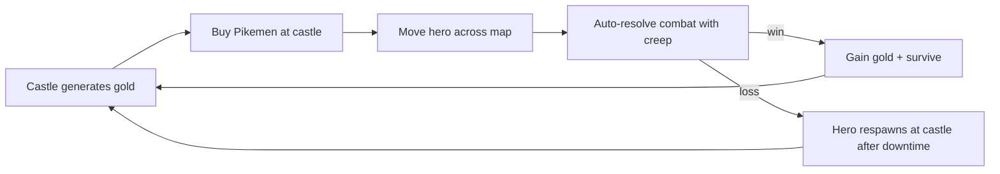

# Game Rules

> **Status:** PoC v0.1 — Locked by Project Lead Agent.
> **Last updated:** 2026-05-20
> **Companion to:** [architecture.md](./architecture.md) (system design) and [agent_tasks.md](./agent_tasks.md) (executor work).

This document is the **game-design bible** for the PoC. Every formula, every constant, every balance number lives here. Code references this doc by section number in comments. If a number is in code but not here, it's a bug.

---

## 1. Core Game Loop



The PoC validates this loop end-to-end for a single hero and a single creep. Multiple iterations of the loop (kill creep, respawn it manually via DB tweak, re-fight) are how we test combat balance.

---

## 2. Map Model

The map is a directed graph stored bidirectionally (see [architecture.md §8.3](./architecture.md#83-map_edges)).

- **Node:** a point on the map. Types: `castle`, `wild`, `creep`.
- **Edge:** a connection between two nodes with a single property: `distance_units` (integer, range 1–100).
- **Heroes can only move between nodes connected by an edge.** No off-road travel, no diagonal shortcuts.

`distance_units` is **a game-design number**, not a pixel distance. The map designer tunes it to control pacing.

---

## 3. Movement

### 3.1 Formula

```
travel_seconds = (edge.distance_units / hero.base_speed) * upkeep_slowdown(army_size)
```

Where:

- `edge.distance_units`: integer 1–100, from `map_edges`.
- `hero.base_speed`: integer, default `10` (units per second). Read from `heroes.base_speed`.
- `upkeep_slowdown(army_size)`: see §4.

The result is **rounded up to the nearest second** before being persisted as `movement_orders.arrive_at - depart_at`. (Sub-second precision adds zero gameplay value and complicates the tick loop.)

### 3.2 Worked Examples

Assumes default `hero.base_speed = 10`.

| Edge | distance_units | army_size | upkeep_slowdown | travel_seconds |
|---|---:|---:|---:|---:|
| Castle → Crossroads | 20 | 0 | 1.000 | 2 |
| Castle → Crossroads | 20 | 50 | 3.322 | 7 |
| Crossroads → Bandit Camp | 30 | 0 | 1.000 | 3 |
| Crossroads → Bandit Camp | 30 | 50 | 3.322 | 10 |
| Crossroads → Bandit Camp | 30 | 200 | 5.322 | 16 |
| Crossroads → Bandit Camp | 30 | 1000 | 7.644 | 23 |

These short timers are intentional for the PoC: a demo run completes a loop in under a minute. Production tuning will scale distances up or introduce a global `TRAVEL_SCALE` constant.

### 3.3 Server-Authoritative Computation

The server computes `travel_seconds` **at the moment of the move request** using the army size **at that moment**. Buying or losing units mid-flight does **not** change the in-flight timer (PoC simplification). Recomputing on army change is a post-PoC feature.

### 3.4 Cancellation (Out of Scope for PoC)

Movement cancellation is deferred. Once `move.request` is accepted, the hero arrives. The `movement_orders.status = 'cancelled'` value exists in the schema for forward-compat but is never written in PoC.

---

## 4. Anti-Snowball A: Upkeep Slowdown

### 4.1 Formula

```
upkeep_slowdown(army_size) = 1 + log2(max(1, army_size / 10))
```

- An army of 0–10 units carries no movement penalty: `slowdown = 1.0`.
- Each doubling above 10 units adds **+1.0** to the multiplier.

### 4.2 Worked Table

| army_size | log2(max(1, army_size/10)) | upkeep_slowdown | Interpretation |
|---:|---:|---:|---|
| 0 | 0.000 | 1.000 | Solo hero, full speed. |
| 1 | 0.000 | 1.000 | Tiny escort, no penalty. |
| 10 | 0.000 | 1.000 | Threshold — no penalty yet. |
| 20 | 1.000 | 2.000 | 2× slower. |
| 50 | 2.322 | 3.322 | 3.3× slower. |
| 100 | 3.322 | 4.322 | 4.3× slower. |
| 200 | 4.322 | 5.322 | 5.3× slower. |
| 500 | 5.644 | 6.644 | 6.6× slower. |
| 1000 | 6.644 | 7.644 | 7.6× slower. |
| 5000 | 8.966 | 9.966 | ~10× slower. |

### 4.3 Design Intent

Logarithmic slowdown means the army gets *meaningfully* slower as it grows, but never *infinitely* slow — a 5000-unit doomstack still moves, just at ~1/10 the pace of a scout. This gives weaker players the **time** to react, dodge, or retreat. It does not make doomstacks unviable; it makes them committal.

### 4.4 Effective Speed (UI hint)

The server exposes the computed effective speed in `hero.state` broadcasts as `speedEffective = base_speed / upkeep_slowdown(army_size)` (rounded to 2 decimals). This is a derived field — the client never computes it.

---

## 5. Anti-Snowball B: Upkeep Gold Cost

### 5.1 Formula

```
upkeep_gold_per_hour(hero) = sum over hero_units of (qty * units.upkeep_gold_per_hour)
```

Deducted from `players.gold` per real-time tick (per-second proration):

```
delta_gold_per_second = -upkeep_gold_per_hour(hero) / 3600
```

Run by the tick engine's upkeep sweep (see [architecture.md §6](./architecture.md#6-tick-engine-design)).

### 5.2 PoC Unit Catalog

One unit type in the `units` table:

| code | name | cost_gold | attack | defense | hp | upkeep_gold_per_hour |
|---|---|---:|---:|---:|---:|---:|
| `pikeman` | Pikeman | 50 | 3 | 2 | 10 | 2.0 |

### 5.3 Worked Economy Examples

Assumes default castle `gold_per_min = 60` → **60 g/min income = 1.0 g/sec**.

| army_size (pikemen) | upkeep g/hr | upkeep g/min | net g/min (income − upkeep) | Sustainable? |
|---:|---:|---:|---:|---|
| 0 | 0 | 0 | +60.0 | Yes |
| 10 | 20 | 0.33 | +59.67 | Yes |
| 50 | 100 | 1.67 | +58.33 | Yes |
| 200 | 400 | 6.67 | +53.33 | Yes |
| 500 | 1000 | 16.67 | +43.33 | Yes |
| 1000 | 2000 | 33.33 | +26.67 | Yes |
| 1800 | 3600 | 60.00 | 0.00 | Breakeven |
| 2000 | 4000 | 66.67 | -6.67 | **Treasury drains** |
| 5000 | 10000 | 166.67 | -106.67 | **Heavy drain** |

The break-even army at PoC base economy is **~1800 pikemen**. Beyond that, you must actively spend down (or lose units in fights) to stay solvent.

### 5.4 Desertion

When `players.gold < 0` at the end of any tick, the tick engine triggers desertion on that player's hero(es):

```
desertion_per_minute = 5%   # of current army_size, rounded up
```

Applied as a per-second proration (`5% / 60 ≈ 0.0833% per tick`, accumulated as a fractional counter on the hero; when the integer floor of the counter increases, that many units are removed and the counter retains its fractional remainder).

Desertion removes Pikemen at random until either:

- `players.gold >= 0` (achieved by reduced upkeep), or
- `army_size = 0` (lone hero state).

A `hero.state` broadcast is emitted on each desertion event (throttled to once per 5s during sustained drain).

### 5.5 Initial Player State

Each new player starts with:

- `players.gold = 200` (4× the cost of one Pikeman).
- One castle at their designated `castle`-kind node, generating 60 g/min.
- One hero at the castle's node, with `base_speed=10`, `attack=2`, `defense=2`, and **zero** units in `hero_units` (must be bought).

---

## 6. Combat

Combat is **deterministic, auto-resolved, server-side**. No RNG in the PoC (RNG is a post-PoC feature flagged in §6.5). The same matchup always produces the same result. This is intentional — it makes the PoC trivially testable.

### 6.1 Trigger

Combat triggers when the tick engine resolves a `move.arrived` whose destination node has an `alive = TRUE` row in `neutral_creeps`. The arrival and the combat are part of the **same Postgres transaction** to ensure atomicity.

### 6.2 Combatant Aggregates

For each side, compute the **stack totals**:

```
side_attack  = hero.attack  + sum(unit.attack  * qty) over hero_units
side_defense = hero.defense + sum(unit.defense * qty) over hero_units
side_hp      = sum(unit.hp  * qty) over hero_units   # creep side: creep.qty * unit.hp
```

The hero contributes their personal `attack`/`defense` as a flat bonus; the hero does **not** contribute `hp` (the hero never dies in PoC, see §6.4).

### 6.3 Round Loop (Pseudo-Code)

```
function resolveCombat(attacker, defender):
    log = []
    round = 0
    while attacker.hp > 0 and defender.hp > 0:
        round += 1

        damage_to_defender = max(1, attacker.attack - defender.defense)
        defender.hp -= damage_to_defender
        log.push({ round, side: "attacker_hits", damage: damage_to_defender, defender_hp_after: max(0, defender.hp) })

        if defender.hp <= 0:
            break

        damage_to_attacker = max(1, defender.attack - attacker.defense)
        attacker.hp -= damage_to_attacker
        log.push({ round, side: "defender_hits", damage: damage_to_attacker, attacker_hp_after: max(0, attacker.hp) })

    outcome = (defender.hp <= 0) ? "win" : "loss"
    return { outcome, log }
```

Key properties:

- **Attacker hits first.** This is a small but consistent edge — moving onto a creep is risky but rewarded.
- **Floor damage of 1.** Two armored stacks never deadlock at 0 damage per round.
- **Termination is guaranteed** — HP only decreases.
- **Log is the full round-by-round record**, persisted to `combat_logs.log` as JSONB.

### 6.4 PoC Casualty Model

After combat resolves:

- **Hero side:**
  - Compute `hp_lost = (initial side_hp) − (final attacker.hp)`.
  - Remove Pikemen from `hero_units` equal to `floor(hp_lost / units.hp)` (whole units only; the partial-unit remainder is **lost** in PoC — no wounded-unit tracking).
  - The hero personally never dies in PoC. If `army_size = 0` after losses and the side still won, the hero stands alone at the node.
  - If the side lost (`defender.hp > 0` at termination), the hero is **defeated**: army is wiped, hero is teleported back to their home castle, and a 60-second `respawn_until` lockout is set on the hero (stored in Redis as `hero:{id}:respawn_until`). During lockout, `move.request` is rejected with `MOVE_HERO_RESPAWNING`.
- **Creep side:**
  - If defeated, set `neutral_creeps.alive = FALSE`. No respawn in PoC (re-enable manually via DB to re-test).
  - If victorious, no state change to the creep.

### 6.5 Future Modifier Interface

Hardcoded for PoC, but executor agents MUST shape combat aggregation as `aggregateStack(hero, hero_units) -> { attack, defense, hp }` so that future skills/gear can be applied as additive modifiers before the round loop:

```
# post-PoC sketch
modifiers = collectModifiers(hero)  # skills, gear, buffs
agg = aggregateStack(hero, hero_units)
for m in modifiers: agg = m.apply(agg)
```

Do not inline the aggregation into the resolve function.

### 6.6 Worked Combat Example

Hero side: hero(attack=2, defense=2) + 30 Pikemen (atk=3, def=2, hp=10).

- `side_attack  = 2 + 30 * 3 = 92`
- `side_defense = 2 + 30 * 2 = 62`
- `side_hp      = 30 * 10 = 300`

Bandit Camp: 50 "Pikeman-equivalent" units (using the same unit row for PoC simplicity).

- `side_attack  = 0 + 50 * 3 = 150`
- `side_defense = 0 + 50 * 2 = 100`
- `side_hp      = 50 * 10 = 500`

Round 1: attacker hits → `damage = max(1, 92 − 100) = 1` → defender.hp = 499. Defender hits → `damage = max(1, 150 − 62) = 88` → attacker.hp = 212.

Floor-damaged from both sides: this matchup is **not winnable** for the hero — defender chips at 1/round while dealing 88/round. The hero will be defeated. Lesson encoded by the PoC: the player must grow their army before challenging the camp. The exact tipping point is a balance exercise once code lands.

### 6.7 Rewards

On hero victory:

- `players.gold += neutral_creeps.gold_reward` (PoC value: `gold_reward = 500`).
- `combat_logs` row written with `outcome = 'win'`, full `log`, `gold_reward = 500`.
- `combat.resolved` envelope broadcast with the same payload.

On hero loss:

- `combat_logs` row written with `outcome = 'loss'`, full `log`, `gold_reward = 0`.
- `combat.resolved` envelope broadcast. Client UI shows a respawn timer.

---

## 7. Castle Economy (Reference)

Already covered in §5. Summary for quick reference:

- One castle per player at PoC, fixed `gold_per_min = 60`.
- Gold ticks **per second** as a fractional amount (`NUMERIC(14,4)` in `players.gold`).
- Castle UI shows integer gold to the user; the fractional tail is internal.
- Upkeep is deducted in the same tick step as income, so the visible `players.gold` already reflects net.

---

## 8. Hero Attributes (PoC)

The hero has exactly three attributes:

- `base_speed` — `INTEGER`, default 10. Distance units traveled per second at army_size ≤ 10.
- `attack` — `INTEGER`, default 2. Flat bonus to side_attack in combat.
- `defense` — `INTEGER`, default 2. Flat bonus to side_defense in combat.

No HP, no level, no XP, no class, no skills. These are all post-PoC and gated by `architecture.md §11`.

---

## 9. Glossary

| Term | Definition |
|---|---|
| **Tick** | One iteration of the server's 1 Hz loop. Drives arrivals, income, upkeep, desertion. |
| **Arrival** | The moment `now() >= movement_orders.arrive_at` for an in-flight order. Resolution is event-driven via Redis ZSET, not per-tick polling. |
| **Edge** | A bidirectional connection between two map nodes, with `distance_units` 1–100. |
| **Stack** | The set of `hero_units` rows for a hero. "Army" and "stack" are used interchangeably. |
| **Upkeep slowdown** | The multiplier in §4 applied to travel time as a function of army size. |
| **Desertion** | Tick-driven removal of units when `players.gold < 0`, per §5.4. |
| **Doomstack** | Informal term for a very large army (typically 1000+ units). Anti-snowball mechanics target this case. |
| **Server time** | `time.Now().UnixMilli()` on the backend. The only authoritative clock. Sent in every WS envelope as `serverTime`. |
| **Side aggregate** | `(attack, defense, hp)` triple computed once per combat per side, in §6.2. |

---

## 10. Tuning Knobs (One Place to Change)

These constants live in `backend/internal/economy/constants.go` (and mirror in `frontend/src/proto/constants.ts` if the client needs them for display). They are the only numbers that should change during balance iteration. Anything else is a structural change and requires a doc PR.

| Constant | Value | Where used |
|---|---:|---|
| `CASTLE_GOLD_PER_MIN_DEFAULT` | 60 | Castle income. |
| `HERO_BASE_SPEED_DEFAULT` | 10 | Movement formula §3. |
| `HERO_ATTACK_DEFAULT` | 2 | Hero side_attack §6.2. |
| `HERO_DEFENSE_DEFAULT` | 2 | Hero side_defense §6.2. |
| `PIKEMAN_COST_GOLD` | 50 | Unit purchase. |
| `PIKEMAN_ATTACK` | 3 | Combat. |
| `PIKEMAN_DEFENSE` | 2 | Combat. |
| `PIKEMAN_HP` | 10 | Combat. |
| `PIKEMAN_UPKEEP_GOLD_PER_HOUR` | 2.0 | Upkeep §5.1. |
| `UPKEEP_SLOWDOWN_BASE` | 10 | Threshold below which slowdown=1.0 §4.1. |
| `DESERTION_PERCENT_PER_MINUTE` | 5 | Desertion rate §5.4. |
| `STARTING_GOLD` | 200 | New player init §5.5. |
| `BANDIT_CAMP_QTY` | 50 | Creep stack size §6.6. |
| `BANDIT_CAMP_GOLD_REWARD` | 500 | Combat victory reward §6.7. |
| `RESPAWN_LOCKOUT_SECONDS` | 60 | Hero defeat lockout §6.4. |
